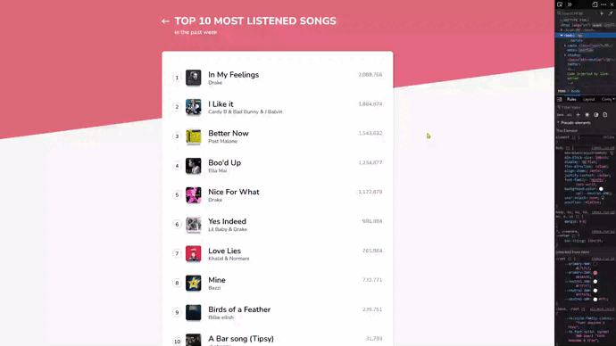

# Top Charts



## *Screenshot* :camera:


## *Links* :link:

[Live site URL](https://mendezpvi.github.io/ict-top-charts/) 👀

[Solution in iCodeThis](https://icodethis.com/modes/design-to-code/133/submissions/313442) 👀

## *What I learnt* :nerd_face:

### `.toLocaleString()`
This method converts a number into a text string according to the specific locale. This includes number formatting settings and other aspects such as thousands separators and decimals. It is useful for presenting numbers in a format that is familiar to the user based on their geographic location or preferred language.

#### Basic number format:
```js
const number = 1234567.89;

console.log(number.toLocaleString('en-US'));
// "1,234,567.89"

console.log(number.toLocaleString('de-DE'));
// "1.234.567,89"
```
#### Additional options:
```js
const number = 1234567.89;
const options = { style: 'currency', currency: 'USD' };
console.log(number.toLocaleString('en-US', options));
// "$1,234,567.89"
```

## *Author* :beginner:
✨ Frontend Mentor - [@mendezpvi](https://www.frontendmentor.io/profile/mendezpvi)

✨ iCodeThis - [@mendezpvi](https://icodethis.com/Vanessa)
